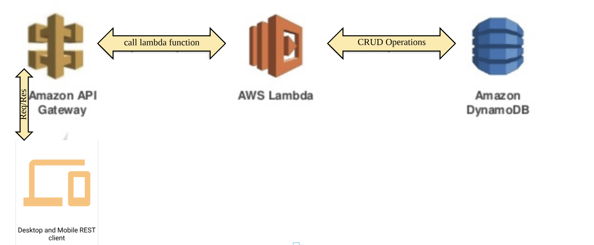

## Serverless Architecture with AWS Lambda, DynamoDB, API Gateway and Java

This code base is an example of how to built API with java runtime for Lambda function, DynamoDB as its data store and API gate way used to expose this AWS Lambda function as a RESTful service which will be invoked by REST clients. The architecture diagram as follows :

### DEPLOYMENT NOTES:

* Create DynamoDB Table: Create table with name 'PRODUCT', The following attributes are required
           
	   
	   id:  String, Partition Key
          name : String
  
* Maven Build : mvn clean package [find the aws-lambda-java-1.0-SNAPSHOT.jar file under target]
* Create Lambda Function : here are the steps 
		
		* select lambda from service console -> create function
		* function name : enter your function name
		* select runtime : java 8
		* click on create function
		* upload your jar file
		* Handler : com.aws.lambda.handler.ProductHandler::handleRequest 	 	 	
